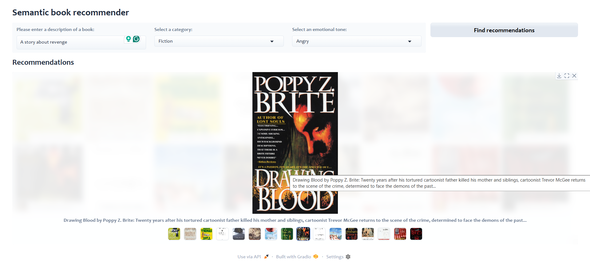

# Semantic_Book_Recommender
Semantic Book Recommender is a Python-based tool that leverages LangChain and the OpenAI API to deliver highly personalized book recommendations via semantic search. By embedding both user preferences and a catalog of book metadata, it finds the closest matches in embedding space—far beyond simple keyword matching.




# How to run?
### STEPS:

Clone the repository

```bash
https://github.com/Chatterjee-Arpan/Semantic_Book_Recommender.git
```
### STEP 01- Create a .env file in your root directory to store your OpenAI API key:

```bash
OPENAI_API_KEY=###############################
```

### STEP 02- Run the Main.ipynb file or install the requirements and run gradio-dashboard.py
**That's it!**

The following is a description of the components in this repo:
* `data-explore.ipynb` is used for data exploration
* `vector-search.ipynb` uses Langchain and Langchain's OpenAI embeddings to build a vector database. This allows users to find the most similar books in response to a Natural Language Query (e.g., "a story about revenge").
* `text-classification.ipynb` does text classification using zero-shot classification from Transformers' "facebook/bart-large-mnli" model. This allows us to classify the books as "fiction" or "non-fiction", creating a facet that users can filter the books on.
* `sentiment-analysis.ipynb` does sentiment analysis using LLMs to extract the emotions from text. This is done using the "j-hartmann/emotion-english-distilroberta-base" library. This will allow users to sort books by their tone, such as how suspenseful, joyful, or sad the books are.
* Finally, **Gradio** is used to create a web application for the users to get book recommendations. (code in `gradio-dashboard.py`)


In order to run the project, the following dependencies are required:
* [kagglehub](https://pypi.org/project/kagglehub/)
* [pandas](https://pypi.org/project/pandas/)
* [matplotlib](https://pypi.org/project/matplotlib/)
* [seaborn](https://pypi.org/project/seaborn/)
* [python-dotenv](https://pypi.org/project/python-dotenv/)
* [langchain-community](https://pypi.org/project/langchain-community/)
* [langchain-opencv](https://pypi.org/project/langchain-opencv/)
* [langchain-chroma](https://pypi.org/project/langchain-chroma/)
* [transformers](https://pypi.org/project/transformers/)
* [gradio](https://pypi.org/project/gradio/)
* [notebook](https://pypi.org/project/notebook/)
* [ipywidgets](https://pypi.org/project/ipywidgets/)
